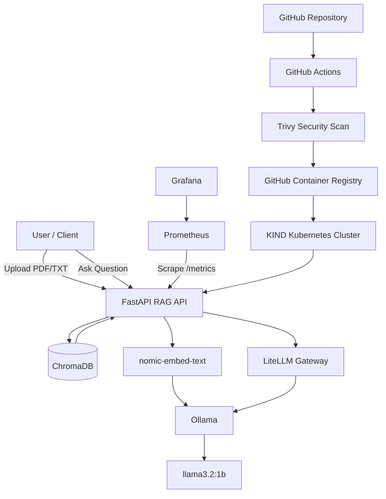

# LLMOps RAG Platform

An end-to-end **LLMOps Retrieval-Augmented Generation (RAG) platform** built with FastAPI, LangChain, ChromaDB, Ollama and LiteLLM.

The project demonstrates a complete local LLMOps workflow including:

- Document ingestion
- Vector embeddings
- Semantic retrieval
- Local LLM inference
- LiteLLM model gateway
- Docker containerization
- Kubernetes deployment using KIND
- Persistent storage
- Prometheus monitoring
- Grafana dashboards
- LLM observability
- Automated testing
- GitHub Actions CI/CD
- GHCR container registry
- Trivy container vulnerability scanning
- Kubernetes resource limits
- Readiness and liveness probes

---

# 1. Architecture



## RAG Request Flow

```text
Document
   |
   v
FastAPI /upload
   |
   v
Text Extraction
   |
   v
Chunking
   |
   v
nomic-embed-text
   |
   v
ChromaDB
   |
   |        User Question
   |             |
   |             v
   +------> Semantic Retrieval
                  |
                  v
             Relevant Chunks
                  |
                  v
               FastAPI
                  |
                  v
               LiteLLM
                  |
                  v
                Ollama
                  |
                  v
             llama3.2:1b
                  |
                  v
                Answer
```

---

# 2. Technology Stack

| Component | Technology |
|---|---|
| API | FastAPI |
| Language | Python |
| RAG Framework | LangChain |
| Vector Database | ChromaDB |
| Embedding Model | nomic-embed-text |
| LLM | llama3.2:1b |
| Local Model Runtime | Ollama |
| LLM Gateway | LiteLLM |
| Containerization | Docker |
| Local Kubernetes | KIND |
| Orchestration | Kubernetes |
| Monitoring | Prometheus |
| Visualization | Grafana |
| Testing | Pytest |
| CI/CD | GitHub Actions |
| Container Registry | GHCR |
| Security Scanner | Trivy |

---

# 3. Repository Structure

```text
llmops-rag/
│
├── app/
│   ├── __init__.py
│   ├── config.py
│   ├── ingestion.py
│   ├── llm.py
│   ├── main.py
│   ├── metrics.py
│   ├── models.py
│   └── retrieval.py
│
├── tests/
│   └── test_api.py
│
├── data/
│   ├── chroma/
│   └── uploads/
│
├── litellm/
│   └── config.yaml
│
├── prometheus/
│   └── prometheus.yml
│
├── grafana/
│   ├── dashboards/
│   │   └── lmops-rag-k8s.json
│   └── provisioning/
│       └── datasources/
│           └── prometheus.yml
│
├── k8s/
│   ├── namespace.yml
│   ├── configmap.yml
│   ├── ollama.yml
│   ├── litellm-config.yml
│   ├── litellm.yml
│   ├── rag-api.yml
│   ├── prometheus.yml
│   ├── grafana.yml
│   └── grafana-dashboard.yml
│
├── .github/
│   └── workflows/
│       └── ci-cd.yml
│
├── Dockerfile
├── docker-compose.yml
├── requirements.txt
├── sample.txt
├── .env.example
├── .gitignore
└── README.md
```

---

# 4. Prerequisites

The following tools are required:

```text
Git
Python 3
Python venv
Docker
kubectl
KIND
Ollama
```

Verify:

```bash
git --version
python3 --version
docker --version
kubectl version --client
kind version
ollama --version
```

Make sure Docker is running:

```bash
sudo systemctl status docker
```

If required:

```bash
sudo systemctl enable --now docker
```

Verify Docker:

```bash
docker ps
```

---

# 5. Clone the Repository

```bash
git clone <your-repository-url>
cd llmops-rag
```

Check:

```bash
git status
```

---

# 6. Python Environment

Create virtual environment:

```bash
python3 -m venv venv
```

Activate it:

```bash
source venv/bin/activate
```

Upgrade pip:

```bash
python -m pip install --upgrade pip
```

Install dependencies:

```bash
pip install -r requirements.txt
```

---

# 7. Configure Environment

Create local environment file:

```bash
cp .env.example .env
```

Add local LiteLLM and Grafana credentials to `.env`.

Example:

```env
APP_NAME=LLMOps RAG API

OLLAMA_BASE_URL=http://localhost:11434

LLM_MODEL=llama3.2:1b
EMBEDDING_MODEL=nomic-embed-text

LITELLM_BASE_URL=http://localhost:4000/v1
LITELLM_MODEL=llama-local
LITELLM_MASTER_KEY=your-local-litellm-key

CHROMA_PATH=./data/chroma
UPLOAD_PATH=./data/uploads

CHUNK_SIZE=512
CHUNK_OVERLAP=50
TOP_K=5

LLM_INPUT_COST_PER_MILLION_TOKENS=0
LLM_OUTPUT_COST_PER_MILLION_TOKENS=0

GRAFANA_ADMIN_PASSWORD=your-local-grafana-password
```

Never commit `.env` or real credentials.

Verify:

```bash
git status
```

`.env` should not be staged or committed.

---

# 8. Start Ollama

Start Ollama:

```bash
ollama serve
```

If Ollama is already running as a service:

```bash
systemctl status ollama
```

Check API:

```bash
curl http://localhost:11434/api/tags
```

---

# 9. Download LLM and Embedding Models

Pull the LLM:

```bash
ollama pull llama3.2:1b
```

Pull embedding model:

```bash
ollama pull nomic-embed-text
```

Verify:

```bash
ollama list
```

Expected models include:

```text
llama3.2:1b
nomic-embed-text
```

---

# 10. Run Application Locally

LiteLLM must be available before the RAG API sends LLM requests.

One option is to start the supporting stack with Docker Compose as described in the next section.

For direct Python development, start the FastAPI application with:

```bash
uvicorn app.main:app --host 0.0.0.0 --port 8000 --reload
```

Health check:

```bash
curl http://localhost:8000/health
```

Expected:

```json
{"status":"ok"}
```

Root endpoint:

```bash
curl http://localhost:8000/
```

Expected:

```json
{"message":"LLMOps RAG API is running"}
```

FastAPI documentation is available at:

```text
http://localhost:8000/docs
```

---

# 11. Docker Compose Deployment

The Docker Compose stack runs:

```text
rag-api
litellm
prometheus
grafana
```

Ollama runs on the host and is accessed through host networking.

Make sure Ollama is running:

```bash
curl http://localhost:11434/api/tags
```

Make sure `.env` contains:

```env
LITELLM_MASTER_KEY=your-local-litellm-key
GRAFANA_ADMIN_PASSWORD=your-local-grafana-password
```

Build and start:

```bash
docker compose up -d --build
```

Check containers:

```bash
docker compose ps
```

Check logs:

```bash
docker compose logs -f rag-api
```

Test API:

```bash
curl http://localhost:8000/health
```

Prometheus:

```text
http://localhost:9090
```

Grafana:

```text
http://localhost:3000
```

Stop the stack:

```bash
docker compose down
```

To also delete Compose volumes:

```bash
docker compose down -v
```

---

# 12. Upload a Document

The API supports:

```text
PDF
TXT
```

A sample document is included as:

```text
sample.txt
```

Upload it:

```bash
curl -X POST \
  http://localhost:8000/upload \
  -F "file=@sample.txt"
```

The response returns a document ID.

Example:

```json
{
  "doc_id": "xxxxxxxx-xxxx-xxxx-xxxx-xxxxxxxxxxxx"
}
```

Save the returned `doc_id`.

---

# 13. Ask a RAG Question

Use the document ID returned by `/upload`.

```bash
curl -X POST \
  http://localhost:8000/ask \
  -H "Content-Type: application/json" \
  -d '{
    "doc_id": "YOUR_DOC_ID",
    "question": "What is this document about?",
    "top_k": 5
  }'
```

Response contains:

```json
{
  "answer": "...",
  "sources": [
    {
      "chunk_index": 0,
      "filename": "sample.txt",
      "excerpt": "..."
    }
  ]
}
```

The complete request path is:

```text
Question
   |
   v
FastAPI
   |
   v
ChromaDB Retrieval
   |
   v
Relevant Context
   |
   v
LiteLLM
   |
   v
Ollama
   |
   v
llama3.2:1b
   |
   v
Answer + Sources
```

---

# 14. Application Metrics

Check Prometheus-formatted metrics:

```bash
curl http://localhost:8000/metrics
```

The application exports metrics for:

```text
RAG request count
RAG request latency
LLM request count
LLM request latency
LLM Time to First Token
Prompt tokens
Completion tokens
Total tokens
Estimated LLM cost
```

Important metric names include:

```text
rag_requests_total
rag_request_latency_seconds
llm_requests_total
llm_request_latency_seconds
llm_ttft_seconds
llm_prompt_tokens_total
llm_completion_tokens_total
llm_tokens_total
llm_estimated_cost_usd_total
llm_last_request_estimated_cost_usd
```

---

# 15. Run Automated Tests

Activate the virtual environment:

```bash
source venv/bin/activate
```

For tests, provide a non-production LiteLLM key because application configuration initializes the LiteLLM client:

```bash
export LITELLM_MASTER_KEY=test-only-key
```

Run:

```bash
pytest -v
```

The automated tests verify:

```text
GET /health
GET /metrics
```

---

# 16. Build Docker Image Manually

Build:

```bash
docker build -t llmops-rag-api:1.0 .
```

Verify:

```bash
docker images | grep llmops-rag
```

---

# 17. Create KIND Kubernetes Cluster

Check existing clusters:

```bash
kind get clusters
```

If the `kind` cluster does not exist:

```bash
kind create cluster --name kind
```

Verify:

```bash
kubectl cluster-info --context kind-kind
```

Set context:

```bash
kubectl config use-context kind-kind
```

Verify:

```bash
kubectl get nodes
```

Expected:

```text
kind-control-plane   Ready
```

---

# 18. Load RAG Image into KIND

The Kubernetes manifest initially references:

```text
llmops-rag-api:1.0
```

Load the locally built image:

```bash
kind load docker-image llmops-rag-api:1.0 --name kind
```

Verify inside the KIND node:

```bash
docker exec kind-control-plane crictl images | grep llmops-rag
```

---

# 19. Create Kubernetes Namespace

```bash
kubectl apply -f k8s/namespace.yml
```

Verify:

```bash
kubectl get namespace llmops
```

---

# 20. Create Kubernetes Secrets

Real secrets are intentionally not stored in Git.

Create LiteLLM secret:

```bash
kubectl create secret generic llmops-secret \
  -n llmops \
  --from-literal=LITELLM_MASTER_KEY='YOUR_LITELLM_KEY'
```

Create Grafana secret:

```bash
kubectl create secret generic grafana-secret \
  -n llmops \
  --from-literal=admin-password='YOUR_GRAFANA_PASSWORD'
```

Verify secret objects:

```bash
kubectl get secrets -n llmops
```

Do not print or commit real secret values.

---

# 21. Validate Kubernetes Manifests

Before deployment:

```bash
kubectl apply --dry-run=client -f k8s/
```

Check YAML formatting:

```bash
git diff --check
```

---

# 22. Deploy Complete Kubernetes Stack

Apply manifests:

```bash
kubectl apply -f k8s/
```

Watch pods:

```bash
kubectl get pods -n llmops -w
```

The main workloads are:

```text
rag-api
litellm
ollama
prometheus
grafana
```

Check services:

```bash
kubectl get svc -n llmops
```

Check persistent volumes:

```bash
kubectl get pvc -n llmops
```

---

# 23. Download Models inside Kubernetes Ollama

The Kubernetes Ollama pod has its own persistent storage.

Pull the LLM:

```bash
kubectl exec -n llmops deployment/ollama -- \
  ollama pull llama3.2:1b
```

Pull embedding model:

```bash
kubectl exec -n llmops deployment/ollama -- \
  ollama pull nomic-embed-text
```

Verify:

```bash
kubectl exec -n llmops deployment/ollama -- \
  ollama list
```

The Ollama PVC preserves downloaded models across pod restarts.

---

# 24. Verify Kubernetes Deployment

```bash
kubectl get pods -n llmops
```

All workloads should become:

```text
1/1 Running
```

Check deployments:

```bash
kubectl get deployments -n llmops
```

Check services:

```bash
kubectl get svc -n llmops
```

Check storage:

```bash
kubectl get pvc -n llmops
```

---

# 25. Kubernetes Health Probes

The project uses readiness and liveness probes.

RAG API:

```text
GET /health
Port 8000
```

LiteLLM:

```text
TCP 4000
```

Ollama:

```text
TCP 11434
```

Prometheus:

```text
/-/ready
/-/healthy
Port 9090
```

Grafana:

```text
/api/health
Port 3000
```

Check pod details:

```bash
kubectl describe pod -n llmops -l app=rag-api
```

---

# 26. Kubernetes Resource Limits

The workloads use CPU and memory requests/limits to prevent uncontrolled resource consumption.

RAG API:

```text
Request: 100m CPU / 256Mi RAM
Limit:   500m CPU / 512Mi RAM
```

LiteLLM:

```text
Request: 100m CPU / 256Mi RAM
Limit:   500m CPU / 512Mi RAM
```

Prometheus:

```text
Request: 100m CPU / 256Mi RAM
Limit:   500m CPU / 512Mi RAM
```

Grafana:

```text
Request: 100m CPU / 256Mi RAM
Limit:   500m CPU / 512Mi RAM
```

Ollama:

```text
Request: 500m CPU / 1Gi RAM
Limit:   2 CPU / 4Gi RAM
```

---

# 27. Access RAG API from Kubernetes

Start port forwarding:

```bash
kubectl port-forward -n llmops svc/rag-api 8001:8000
```

Keep that terminal open.

From another terminal:

```bash
curl http://localhost:8001/health
```

Expected:

```json
{"status":"ok"}
```

---

# 28. Upload Document to Kubernetes RAG API

```bash
curl -X POST \
  http://localhost:8001/upload \
  -F "file=@sample.txt"
```

Copy the returned `doc_id`.

---

# 29. Ask Question on Kubernetes

```bash
curl -X POST \
  http://localhost:8001/ask \
  -H "Content-Type: application/json" \
  -d '{
    "doc_id": "YOUR_DOC_ID",
    "question": "What is this document about?",
    "top_k": 5
  }'
```

A successful response confirms:

```text
FastAPI
   ↓
ChromaDB
   ↓
LiteLLM
   ↓
Ollama
   ↓
LLM
```

are communicating correctly.

---

# 30. Verify Metrics on Kubernetes

With RAG API port forwarding active:

```bash
curl http://localhost:8001/metrics
```

Generate at least one `/ask` request before checking LLM counters.

Example:

```bash
curl -s http://localhost:8001/metrics | \
grep -E 'rag_requests_total|llm_requests_total|llm_tokens_total|llm_ttft'
```

---

# 31. Access Prometheus

Start:

```bash
kubectl port-forward -n llmops svc/prometheus 9091:9090
```

Open:

```text
http://localhost:9091
```

Useful PromQL examples:

```promql
rag_requests_total
```

```promql
llm_requests_total
```

```promql
llm_tokens_total
```

Average LLM latency:

```promql
llm_request_latency_seconds_sum
/
llm_request_latency_seconds_count
```

Average TTFT:

```promql
llm_ttft_seconds_sum
/
llm_ttft_seconds_count
```

Average RAG latency:

```promql
rag_request_latency_seconds_sum
/
rag_request_latency_seconds_count
```

---

# 32. Access Grafana

Start:

```bash
kubectl port-forward -n llmops svc/grafana 3001:3000
```

Open:

```text
http://localhost:3001
```

Login:

```text
Username: admin
Password: value used while creating grafana-secret
```

Prometheus is provisioned automatically as the Grafana datasource.

The project also contains a provisioned LLMOps dashboard.

Generate RAG traffic before expecting token/latency panels to contain data.

---

# 33. Persistent Storage

The Kubernetes deployment uses PVCs for persistent application data.

Check:

```bash
kubectl get pvc -n llmops
```

Configured storage includes:

```text
rag-data-pvc      2Gi
ollama-pvc       10Gi
prometheus-pvc    2Gi
grafana-pvc       1Gi
```

RAG data stores:

```text
Uploaded documents
ChromaDB vector database
```

Ollama storage preserves:

```text
Downloaded models
```

Prometheus storage preserves:

```text
Metrics data
```

Grafana storage preserves:

```text
Grafana application data
```

---

# 34. Grafana and Prometheus Deployment Strategy

Grafana and Prometheus use:

```yaml
strategy:
  type: Recreate
```

This is intentional because both workloads use persistent local application data.

`Recreate` prevents old and new replicas from trying to access the same application database/storage simultaneously during deployment.

---

# 35. CI/CD Architecture

```text
Developer
    |
    | git push
    v
GitHub
    |
    v
GitHub Actions
    |
    +--> Checkout
    |
    +--> Python Validation
    |
    +--> Pytest
    |
    +--> Kubernetes Dry Run
    |
    +--> GHCR Login
    |
    +--> Docker Build
    |
    +--> Trivy Security Scan
    |
    |    HIGH/CRITICAL?
    |       |
    |       +-- YES --> FAIL
    |       |
    |       +-- NO
    |
    +--> Push Image to GHCR
    |
    +--> Load Image into KIND
    |
    +--> kubectl apply
    |
    +--> Update RAG Deployment
    |
    +--> Wait for Rollout
    |
    +--> Kubernetes Verification
    |
    +--> API Health Check
    |
    v
Deployment Successful
```

---

# 36. Self-Hosted GitHub Actions Runner

The CI/CD pipeline uses:

```yaml
runs-on:
  - self-hosted
  - Linux
  - X64
```

Therefore the runner machine must have:

```text
Docker
Python
kubectl
KIND
Access to the KIND cluster
```

In the GitHub repository, create a Linux x64 self-hosted runner from:

```text
Settings
  -> Actions
  -> Runners
  -> New self-hosted runner
```

Follow the commands provided by GitHub for the repository.

Do not store or document the temporary runner registration token.

After configuration, install the runner as a service:

```bash
sudo ./svc.sh install
sudo ./svc.sh start
sudo ./svc.sh status
```

Do not run `./run.sh` at the same time if the systemd runner service is already running.

---

# 37. GitHub Actions Workflow

The workflow is located at:

```text
.github/workflows/ci-cd.yml
```

It runs automatically on:

```text
Push to main
```

and also supports:

```text
workflow_dispatch
```

The pipeline uses the commit SHA as the Docker image tag:

```text
ghcr.io/<owner>/llmops-rag:<commit-sha>
```

This provides immutable image versions for deployments.

---

# 38. GHCR Authentication

GitHub Actions uses the built-in:

```text
GITHUB_TOKEN
```

with:

```yaml
permissions:
  contents: read
  packages: write
```

The pipeline authenticates to GHCR before pushing the image.

No personal access token needs to be committed to the repository.

---

# 39. Trivy Security Gate

Every newly built RAG API Docker image is scanned with Trivy.

The pipeline scans:

```text
HIGH
CRITICAL
```

vulnerabilities.

Configuration:

```yaml
severity: 'HIGH,CRITICAL'
ignore-unfixed: true
exit-code: '1'
```

Flow:

```text
Docker Image
     |
     v
Trivy Scan
     |
     v
HIGH/CRITICAL fixed vulnerability?
     |
 +---+---+
 |       |
YES      NO
 |       |
FAIL     Continue
         |
         v
        GHCR
         |
         v
     Kubernetes
```

Because the scan runs before the GHCR push, a failing security scan prevents the new image from being pushed and deployed.

---

# 40. Trigger CI/CD Deployment

After making a change:

```bash
git status
git diff --check
git add .
git commit -m "your commit message"
git push origin main
```

GitHub Actions automatically starts the pipeline.

After successful deployment:

```bash
kubectl get pods -n llmops
```

Check the deployed RAG image:

```bash
kubectl get deployment rag-api \
  -n llmops \
  -o jsonpath='{.spec.template.spec.containers[0].image}{"\n"}'
```

The image should contain the Git commit SHA.

---

# 41. Verify RAG API Logs

```bash
kubectl logs -n llmops deployment/rag-api
```

Follow logs:

```bash
kubectl logs -n llmops deployment/rag-api -f
```

LiteLLM:

```bash
kubectl logs -n llmops deployment/litellm
```

Ollama:

```bash
kubectl logs -n llmops deployment/ollama
```

Prometheus:

```bash
kubectl logs -n llmops deployment/prometheus
```

Grafana:

```bash
kubectl logs -n llmops deployment/grafana
```

---

# 42. Common Troubleshooting

## Pod not running

```bash
kubectl get pods -n llmops
```

Describe:

```bash
kubectl describe pod -n llmops <pod-name>
```

Logs:

```bash
kubectl logs -n llmops <pod-name>
```

---

## Image not found in KIND

Check:

```bash
docker images
```

Reload:

```bash
kind load docker-image llmops-rag-api:1.0 --name kind
```

---

## Ollama model missing

```bash
kubectl exec -n llmops deployment/ollama -- ollama list
```

Pull again if required:

```bash
kubectl exec -n llmops deployment/ollama -- \
  ollama pull llama3.2:1b
```

```bash
kubectl exec -n llmops deployment/ollama -- \
  ollama pull nomic-embed-text
```

---

## LiteLLM connectivity

Check service:

```bash
kubectl get svc litellm -n llmops
```

Logs:

```bash
kubectl logs -n llmops deployment/litellm
```

---

## RAG API health failure

```bash
kubectl exec -n llmops deployment/rag-api -- \
  python -c \
  "import urllib.request; print(urllib.request.urlopen('http://localhost:8000/health').read().decode())"
```

---

## Prometheus targets

Port forward:

```bash
kubectl port-forward -n llmops svc/prometheus 9091:9090
```

Then inspect Prometheus targets from the Prometheus UI.

The RAG API target should be reachable as:

```text
rag-api:8000
```

---

## Grafana shows no LLM data

First generate a RAG request through `/ask`.

Then verify:

```bash
curl -s http://localhost:8001/metrics | \
grep -E 'llm_requests_total|llm_tokens_total|llm_ttft'
```

If counters are present, wait for Prometheus to scrape them and refresh Grafana.

---

## Grafana or Prometheus storage lock

Both deployments use `Recreate`.

If an interrupted rollout leaves conflicting pods, verify:

```bash
kubectl get pods -n llmops
```

If necessary, restart the affected deployment:

```bash
kubectl rollout restart deployment/grafana -n llmops
```

or:

```bash
kubectl rollout restart deployment/prometheus -n llmops
```

---

# 43. Final End-to-End Verification

Run:

```bash
kubectl get pods -n llmops
```

All five workloads should be healthy:

```text
rag-api
litellm
ollama
prometheus
grafana
```

Check services:

```bash
kubectl get svc -n llmops
```

Check PVCs:

```bash
kubectl get pvc -n llmops
```

Start API forwarding:

```bash
kubectl port-forward -n llmops svc/rag-api 8001:8000
```

Health:

```bash
curl http://localhost:8001/health
```

Upload:

```bash
curl -X POST \
  http://localhost:8001/upload \
  -F "file=@sample.txt"
```

Copy the returned document ID and test:

```bash
curl -X POST \
  http://localhost:8001/ask \
  -H "Content-Type: application/json" \
  -d '{
    "doc_id": "YOUR_DOC_ID",
    "question": "What is this document about?",
    "top_k": 5
  }'
```

Metrics:

```bash
curl -s http://localhost:8001/metrics | \
grep -E 'rag_requests_total|llm_requests_total|llm_tokens_total'
```

If all of these work, the end-to-end platform is operational.

---

# 44. Cleanup

## Delete Kubernetes resources

```bash
kubectl delete namespace llmops
```

This removes namespace-scoped workloads and PVCs.

## Delete KIND cluster

```bash
kind delete cluster --name kind
```

## Docker Compose cleanup

```bash
docker compose down -v
```

---

# 45. Security Practices

This project follows several basic security practices:

- Secrets are not stored in Kubernetes YAML files.
- `.env` is excluded from Git.
- GitHub Actions uses `GITHUB_TOKEN` for GHCR.
- Docker images are scanned by Trivy.
- HIGH/CRITICAL fixable vulnerabilities block deployment.
- Kubernetes workloads use resource limits.
- Kubernetes workloads use readiness/liveness probes.
- Credentials should never be placed in README files.
- Runner registration tokens should never be committed.
- Container images deployed by CI are tagged with Git commit SHA.

---

# 46. Current Limitations

This project is designed primarily as a local LLMOps/Kubernetes portfolio and learning platform.

Current deployment uses:

```text
Local machine
KIND Kubernetes
Self-hosted GitHub Actions runner
Local Ollama inference
```

It is not currently designed as a production multi-node cloud deployment.

---

# 47. Future Improvements

Possible future enhancements:

```text
Helm charts
Argo CD GitOps
AWS EKS
Terraform
Cloud object storage
Managed vector database
External secrets management
Production ingress and TLS
```

These are intentionally outside the current project scope.

---

# 48. Project Highlights

This project demonstrates practical experience with:

```text
LLMOps
RAG
Local LLMs
Vector Databases
REST APIs
Docker
Kubernetes
Persistent Storage
CI/CD
Container Registries
Security Scanning
Monitoring
Observability
Prometheus
Grafana
GitHub Actions
```

---

# 49. Deployment Summary

```text
                    DEVELOPMENT
                         |
                         v
                   Python/FastAPI
                         |
                         v
                       Docker
                         |
                         v
                  GitHub Repository
                         |
                         v
                   GitHub Actions
                         |
          +--------------+--------------+
          |              |              |
          v              v              v
        Tests      Kubernetes       Docker Build
                   Validation
                                      |
                                      v
                                 Trivy Scan
                                      |
                                      v
                                     GHCR
                                      |
                                      v
                                KIND Kubernetes
                                      |
            +-------------------------+----------------------+
            |              |             |          |       |
            v              v             v          v       v
         RAG API        LiteLLM        Ollama   Prometheus Grafana
            |              |             |
            |              +------> llama3.2:1b
            |
            +------> ChromaDB
            |
            +------> nomic-embed-text
```

---

# 50. Status

**Project Status: Complete**

The platform provides an end-to-end local LLMOps workflow covering:

**RAG application development → local LLM inference → containerization → Kubernetes orchestration → persistent storage → monitoring → LLM observability → automated testing → CI/CD → container registry → vulnerability scanning → automated deployment.**
